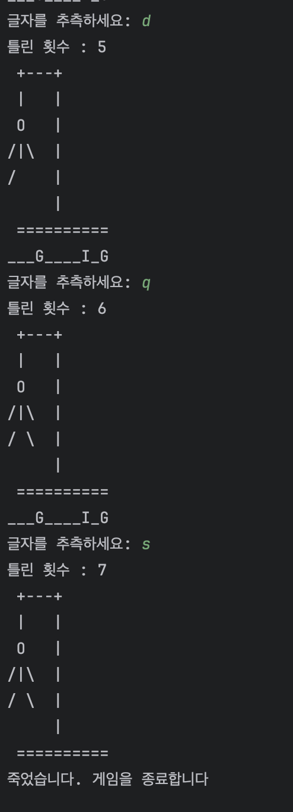
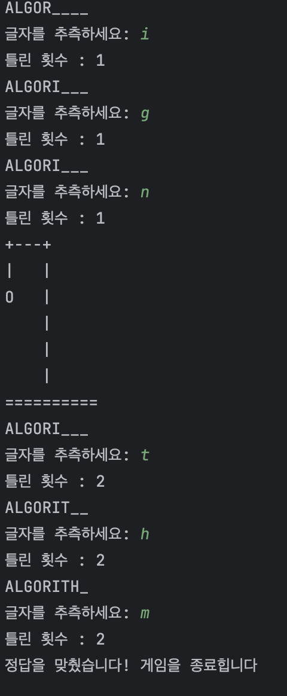
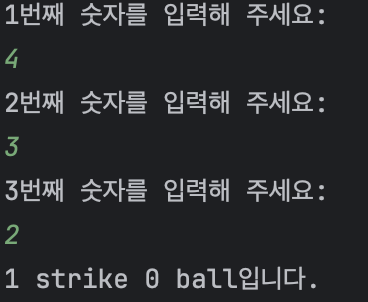
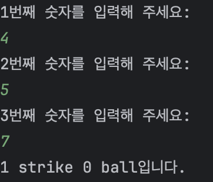
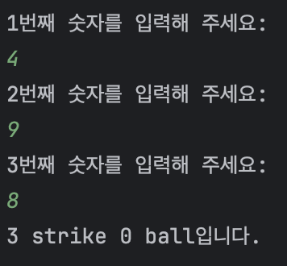
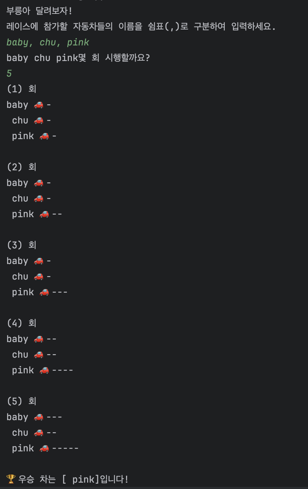

# Java 연습 파일

---
## 1. 자바 기본 구조 / 테스트
### 자바에 대해서 학습한 내용 기록
- 함수, 함수&List
- 자료구조, 자료구조반복문, 자료구조 함수 테스트 및 학습
- map, map&List
- class, 참조, 
- streamAPl

---
## 2. 자바 실습 - 행맨게임
- 흔히 아는 행멘게임을 코딩으로 작성해보자
- ✅hangman 폴더 참고
- Application 실행 시 게임 시작 

### <행멘게임 실패 이미지>

### <행맨게임 성공 이미지>

---
## 3. 자바 실습 - 야구게임
- 컴퓨터가 가진 세 자리 숫자(중복되지 않는 1-9 사이의 숫자)를 맞히는 게임입니다.
- ✅numberbaseballv2 폴더 참고
- Application 실행 시 게임 시작 

### <야구게임 실행 결과 이미지>
#### 첫번째 시도 

#### 두번째 시도

#### 세번째 시도 

맞추면 게임 끝

---
## 4. 자바 실습 - 자동차 레이싱 게임
- 기능 요구사힝
  - 자동차 이름은 10자를 초과할 수 없습니다.
  - 사용자에게 여러 자동차들의 이름을 한 줄에 한 번에 입력받되 쉼표(,)로 구분합니다.
  - 사용자에게 몇 회를 시행할지 입력받습니다.
  - 사용자가 잘못된 값을 입력하면 `IllegalArgumentException`을 발생시키고, `"[ERROR]"`로 시작하는 에러 메시지를 출력하세요. 그리고 그 부분부터 다시 입력받으세요.
  - 매 회차마다 자동차는 전진하거나 멈추어 있습니다.
      - 주사위를 굴리는 것처럼, 1~6 사이의 값을 랜덤으로 구한 후,
      - 3, 4, 5, 6이면 전진, 1, 2면 정지합니다.
  - 공동 우승자가 있을 수 있습니다.
- ✅racing 폴더 참고
- Application 실행 시 게임 시작 

### <레이싱 게임 실행 이미지>
